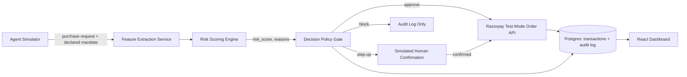

# MandateSentinel — Product Requirements Document

**Track:** AI Risk Manager (Track 2), framed to double as an AI Growth & Agentic Commerce (Track 1) enabler
**One-liner:** A real-time behavioral trust gate that sits between an inbound AI purchasing agent and a merchant's Razorpay checkout, and decides — in under 300ms, with a full audit trail — whether to approve, step-up, or block each transaction based on whether it's actually consistent with what the agent was authorized to do.

---

## 1. Problem Statement

Agentic commerce today (Razorpay's own live agent-payments stack included) secures transactions with **static controls**: consent-based pre-authorization, a spend cap (e.g. UPI Reserve Pay), upfront authentication. These stop an agent from spending *more* than it's allowed to. They do nothing to check whether a specific request is *the right thing* — an agent can stay under its spend cap, pass authentication, and still buy the wrong item, get hijacked mid-session via prompt injection, or drift off its original task, and nothing catches it before settlement. Razorpay's own team has publicly said that when this happens today, the merchant eats the liability.

Standard fraud tooling doesn't help here either — velocity checks and anomaly detection are tuned to human behavior. An agent legitimately transacting 50 times in an hour doesn't look like fraud to those systems; it looks like normal agent throughput. There's currently no layer that asks, per-request: *"does this match what this agent said it was going to do?"*

MandateSentinel is that layer.

## 2. Goals

- Ship a **working, defense-only** detector that scores each inbound agent transaction request for behavioral consistency against its own declared mandate, and gates it (approve / step-up / block) in real time.
- Report **measured precision and recall on a held-out synthetic test set** — not a cherry-picked demo.
- Produce a **full audit trail** for every decision: what was requested, what was scored, why the decision was made.
- Route every *approved* transaction through a **real Razorpay test-mode Order** so the demo shows an actual artifact in the Razorpay dashboard, not a mocked API call.
- Present results so a non-technical reviewer sees the business case immediately: money protected, false-positive rate, added latency, and the "this is what lets you raise agent spend limits safely" argument.

## 3. Non-Goals (say this explicitly in the repo and the pitch)

- Not a general-purpose fraud engine. It doesn't try to catch card fraud, stolen credentials, or human-driven chargebacks — those are already solved by Razorpay's existing tools.
- Not offense-capable in any way — no code that could itself be used to bypass a merchant's controls, spoof an agent identity, or fabricate authorization. Track 2 disqualifies anything offense-capable; keep the repo unambiguously a verifier, never an attacker tool, and say so in the README.
- Not trying to replace NPCI's UAP or Razorpay's existing spend-cap/consent layer. MandateSentinel assumes an agent is already authenticated and within its spend cap — it's the next layer down, not a replacement.
- Not claiming zero false positives. The pitch explicitly shows one false positive and how it's handled gracefully (step-up, not silent block) — the buildathon brief asks for exactly this.

## 4. Success Metrics (what you report in the video)

| Metric | Target for the demo |
|---|---|
| Precision on held-out set | Report the real number — aim to design toward ≥0.85 |
| Recall on held-out set | Report the real number — aim to design toward ≥0.85 |
| Added decision latency | <300ms per request (state this — it directly rebuts "risk gates add friction") |
| $ volume of adversarial sessions blocked/stepped-up | Absolute number from your synthetic set |
| Audit trail completeness | 100% of decisions have a logged reason and feature snapshot |

---

## 5. System Architecture



Everything runs as one deployable service for the demo (single FastAPI app + one React frontend). Don't build this as real microservices — a hackathon judge cares that the loop works and is explainable, not that it's horizontally scalable.

---

## 6. Tech Stack

No stack is mandated by the buildathon, so align with what Razorpay itself actually runs — it signals you understand their environment, and it's a stack your vibe coder will build fast and cleanly in.

| Layer | Choice | Why |
|---|---|---|
| Backend | **Python + FastAPI** | Matches Razorpay's own 2026 Agent Studio / Agentic Experience Platform, which Razorpay has publicly said is built on the **Claude Agent SDK**. Also the natural pairing for scikit-learn + Anthropic SDK calls, and fast to scaffold. |
| Agent reasoning / semantic-drift check | **Anthropic API (Claude) or a small local embedding model** | Use Claude for the "does this request semantically match the declared mandate" judgment call and for generating the human-readable reason string in the audit log — this doubles as your "meaningful use of AI" proof point, not just a stats model. Keep it off the hot path where possible (cache/embed once per session goal, compare with cheap cosine similarity per request) to hit the latency target. |
| Anomaly / rules layer | **scikit-learn (Isolation Forest)** for the statistical layer, plain rule checks for hard limits (category allowlist, per-txn cap) | Hybrid rules + ML is faster to build, easier to explain to a panel, and matches the "explainable, bounded, gated" bar better than a black-box model. |
| Datastore | **PostgreSQL** | Matches Razorpay's own stack (they run Postgres/MySQL); use it for transactions + audit log. |
| Session/rate state | **Redis** | Matches Razorpay's stack; use for session velocity counters and cumulative-spend tracking. |
| Payments integration | **Razorpay Python SDK (`razorpay` package), test-mode keys** | `client.order.create({...})` against `https://api.razorpay.com/v1`, test mode keys (`rzp_test_...`), auto-refund on uncaptured orders — no real money ever moves. |
| Frontend | **React** | Matches Razorpay's own frontend/dashboard stack. Use `recharts` for the metrics panel. |
| Packaging | **Docker** (single `docker-compose.yml`: api + postgres + redis + frontend) | Matches their Kubernetes/Docker environment, and makes the repo trivially runnable by a reviewer. |

---

## 7. Component Detail

### 7.1 Agent Simulator
A script (not a UI) that generates purchase-request sessions and posts them to the gate's `/evaluate` endpoint. Each session has:
- `agent_id`, `session_id`
- a **declared mandate**: `{goal_description, category_allowlist, max_txn_amount, max_session_total, expected_request_count}`
- a stream of `{amount, category, merchant_id, item_description, timestamp}` requests

Generate two populations:
- **Clean (≈80%):** requests consistent with the declared mandate — amount near expected distribution, category in allowlist, normal cadence.
- **Adversarial (≈20%):** inject one attack pattern per session, drawn from:
  - *category swap* — item/category outside the allowlist despite a valid-looking merchant
  - *spend spike* — single request or cumulative total pushes past the declared cap
  - *velocity burst* — many requests in a short window (simulated hijack/loop)
  - *semantic drift* — same category/merchant, but item description no longer matches the stated session goal (the subtle case regex/category rules miss — this is where the embedding-similarity check earns its keep)
  - *session hijack* — mid-session goal change with no new mandate issued

### 7.2 Feature Extraction Service
For each incoming request, compute:
- `amount_delta_from_expected`
- `category_in_allowlist` (bool)
- `cumulative_session_spend_ratio` = running total / `max_session_total`
- `velocity` = requests in last N minutes vs session baseline (from Redis counters)
- `semantic_similarity` = cosine similarity between `item_description` embedding and `goal_description` embedding
- `novelty_score` = has this merchant/category been seen before in this session

### 7.3 Risk Scoring Engine
```
hard_block  = amount > max_txn_amount OR NOT category_in_allowlist
risk_score  = w1*(1 - semantic_similarity)
            + w2*isolation_forest_anomaly_score(features)
            + w3*velocity_zscore
            + w4*cumulative_session_spend_ratio_overage
```
Tune weights against the training split only; never against the held-out test split.

### 7.4 Decision Policy Gate
```
if hard_block:                 decision = BLOCK
elif risk_score >= T_block:    decision = BLOCK
elif risk_score >= T_stepup:   decision = STEP_UP
else:                           decision = APPROVE
```
- `APPROVE` → call Razorpay test-mode Order API, store `order_id` on the transaction record.
- `STEP_UP` → simulate a human-confirmation step (a simple "confirm/deny" call in the demo harness) and log the outcome either way — this is your "one failure handled gracefully" moment.
- `BLOCK` → never touches the Razorpay API; log reason and stop.

### 7.5 Audit Log
Every decision writes one row: `timestamp, agent_id, session_id, request_payload, feature_snapshot, risk_score, top_contributing_features, decision, reason_text (Claude-generated, human-readable), razorpay_order_id (nullable)`.

### 7.6 Dashboard (React)
- Live feed of decisions (approve/step-up/block) as the simulator runs
- Precision/recall/F1 on the held-out set, computed and displayed, not hardcoded
- $ volume approved vs. blocked vs. stepped-up
- Click-through on any row to see the full audit entry and reasoning
- One highlighted "false positive, handled via step-up" case for the pitch

---

## 8. Data Model (Postgres)

```sql
CREATE TABLE sessions (
    session_id UUID PRIMARY KEY,
    agent_id TEXT,
    goal_description TEXT,
    category_allowlist TEXT[],
    max_txn_amount NUMERIC,
    max_session_total NUMERIC,
    created_at TIMESTAMPTZ
);

CREATE TABLE requests (
    request_id UUID PRIMARY KEY,
    session_id UUID REFERENCES sessions(session_id),
    amount NUMERIC,
    category TEXT,
    merchant_id TEXT,
    item_description TEXT,
    is_adversarial BOOLEAN,       -- ground truth, from the simulator, used only for eval
    attack_type TEXT,             -- nullable, ground truth
    created_at TIMESTAMPTZ
);

CREATE TABLE decisions (
    decision_id UUID PRIMARY KEY,
    request_id UUID REFERENCES requests(request_id),
    risk_score NUMERIC,
    feature_snapshot JSONB,
    decision TEXT,                -- APPROVE | STEP_UP | BLOCK
    reason_text TEXT,
    razorpay_order_id TEXT,
    latency_ms INTEGER,
    created_at TIMESTAMPTZ
);
```

## 9. API Contract

```
POST /session          -> create a session with a declared mandate
POST /evaluate          -> {session_id, amount, category, merchant_id, item_description}
                            returns {decision, risk_score, reason_text, razorpay_order_id?}
POST /stepup/{decision_id}/confirm  -> simulate human confirmation resolving a STEP_UP
GET  /metrics            -> precision, recall, F1 on held-out set; $ volumes; latency stats
GET  /audit/{decision_id} -> full audit record
```

## 10. Evaluation Methodology

1. Generate the full synthetic dataset (target: 800–1,200 requests across ~100–150 sessions, ~20% adversarial).
2. Split 70/30 train/held-out **before** touching thresholds or Isolation Forest fit.
3. Fit the anomaly model and tune `T_stepup` / `T_block` on the training split only.
4. Run the held-out split once, unmodified, and report precision/recall/F1 treating `is_adversarial` as ground truth and `decision != APPROVE` as a positive prediction.
5. Report the confusion matrix in the video, not just the headline numbers — this is what "honest metrics" looks like to a judge who reads the brief closely.

---

## 11. Non-Functional Requirements

- **Latency:** total `/evaluate` response time <300ms on the demo hardware — state this explicitly, since the whole industry argument against risk gates is that they slow down "the speed of intent" agentic commerce is selling.
- **Explainability:** every decision must have a human-readable reason, not just a score.
- **Defense-only:** no component of the repo can be repurposed to bypass authorization or fabricate agent credentials. Say this in the README's first paragraph.
- **No real money:** test-mode keys only, `rzp_test_...`, never live keys, checked into `.gitignore`/`.env.example` pattern, never committed.

---

## 12. Mapping to Buildathon Deliverables

| Required deliverable | How this PRD covers it |
|---|---|
| Public repo, working | FastAPI + React + Postgres/Redis, `docker-compose up` runnable |
| Architecture documentation | This PRD + the mermaid diagram in §5, drop both into the repo README |
| 5-minute pitch video | See §13 script below |
| Measurable results + audit trail | §10 evaluation methodology + §7.5 audit log |

## 13. Demo / Pitch Video Script (5 minutes)

1. **0:00–0:45** — The gap: Razorpay's own agentic payments demo (cite the MediaNama review) shows spend caps and consent, but no answer for "agent orders the wrong thing." Standard fraud tools don't catch agent behavior. State the business cost: this is what currently makes merchants eat the liability, and what caps how aggressively Razorpay can raise agent spend limits.
2. **0:45–1:30** — What MandateSentinel is: one sentence, then the architecture diagram.
3. **1:30–3:00** — Live run: simulator fires a session, show an approved request hit the real Razorpay test dashboard, show a blocked adversarial request with its reason, show one step-up case resolved.
4. **3:00–4:00** — Numbers: precision/recall on the held-out set, confusion matrix, latency, $ volume protected.
5. **4:00–4:45** — The business pitch: frame it as the same commercial shape as Buyer Protection / Chargeback Fraud Protection, but for agent-initiated transactions — a layer that lets Razorpay sell higher agent spend limits with confidence instead of capping adoption.
6. **4:45–5:00** — What's explicitly out of scope / what you'd build next with more time.

---

## 14. Build Plan (assumes a short buildathon window — adjust to your actual deadline)

- **Day 1:** Data model, `/session` + `/evaluate` skeleton, synthetic dataset generator (clean + all 5 adversarial patterns), Razorpay test-mode integration working end to end for a hardcoded approve.
- **Day 2:** Feature extraction, Isolation Forest + rules scoring, decision policy, audit logging, `/metrics` endpoint computing real precision/recall.
- **Day 3:** React dashboard (live feed, metrics, audit drill-down), step-up flow, latency instrumentation.
- **Day 4:** Run the full held-out evaluation, tune thresholds honestly, write the README + architecture doc, record the pitch video.

## 15. Open Risks

- Semantic-similarity check depends on embedding quality for short item descriptions — validate this early on a handful of hand-written examples before building the full dataset generator around it.
- Isolation Forest needs enough clean training data to establish a sane baseline — if the synthetic generator's "clean" distribution is too narrow, everything will look anomalous. Sanity-check the score distribution before wiring up thresholds.
- Keep the Claude calls (semantic check, reason-text generation) off the hot path or cached per-session goal — don't let an LLM call be the thing that blows your 300ms latency budget.
