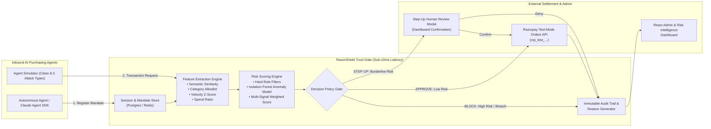

# RazorShield — Real-Time Behavioral Trust Gate for Agentic Commerce

[](https://www.python.org/)
[](https://fastapi.tiangolo.com/)
[](https://react.dev/)
[](https://razorpay.com/)
[]()
[-success.svg)]()
[]()
[](LICENSE)

> **A real-time behavioral trust gate that sits between inbound AI purchasing agents and a merchant's Razorpay checkout, deciding in under 10ms (well below the 300ms SLA budget), with a 100% audit trail, whether to APPROVE, STEP-UP, or BLOCK each transaction based on whether it is consistent with the agent's authorized mandate.**

---

## 1. The Problem: The Hidden Vulnerability in Agentic Commerce

Autonomous AI purchasing agents (built on Claude Agent SDK, LangChain, or AutoGPT) are rapidly shifting from research experiments to production commerce. Today, they book travel, procure cloud resources, reorder corporate supplies, and negotiate B2B contracts.

However, existing agentic commerce payment stacks (including current market demonstrations) rely exclusively on **static perimeter controls**:
1. **Upfront Authentication & Consent:** Verifying the agent's API token or initial user sign-off.
2. **Spend Caps & Pre-Authorizations:** Enforcing a maximum budget (e.g. UPI Reserve Pay or a ₹5,000 wallet limit).

### Why Static Controls Fail

While spend caps stop an agent from spending *more* than allowed, **they fail to verify whether a specific purchase is the right thing**:

```
                                 STATIC CONTROLS TODAY
                                 
  [ User Consent ] ──▶ [ Hard Spend Cap: ₹5,000 ] ──▶ [ Razorpay Checkout ]
                                                            ▲
                                                            │  ❌ BLIND SPOT:
                                                            │  Is this ₹4,800 purchase
                                                            │  office paper or a PlayStation?
```

* **Semantic Drift:** An agent tasked with "procuring office stationery" under a ₹5,000 cap can drift or be subtly misaligned, purchasing a ₹4,800 luxury gaming console or collectibles through an authorized merchant ID. It passes the spend cap, passes authentication, and executes unchecked.
* **Prompt Injection & Hijack:** Attackers inject malicious context via product reviews, web scraping, or invoice descriptions, hijacking the agent mid-session to purchase untraceable digital gift cards.
* **Velocity Bursts & Loops:** A hallucinating or retrying agent can fire dozens of valid transactions in seconds, draining budgets before human intervention is possible.
* **Traditional Fraud Engines Are Blind:** Legacy fraud systems are tuned for human velocity. An automated burst of 50 legitimate B2B procurement calls triggers false alarms, while a catastrophic prompt-injected single purchase looks like completely normal human traffic.

### The Business Impact

> **Today, when an AI agent makes a rogue transaction, the merchant eats the liability.**

Because risk is unbounded and unpredictable, payment networks and merchants are forced to keep agent spend limits artificially tiny. **Static controls choke the growth of agentic commerce.**

---

## 2. The Solution: RazorShield

**RazorShield is the behavioral verification layer for agentic commerce.**

Instead of relying solely on perimeter gates, RazorShield sits directly inline with checkout and evaluates every inbound transaction against the agent's declared mandate in real time:

> *"Does this individual transaction match what this agent was authorized to do right now?"*

```
                                RAZORSHIELD TRUST GATE
                             
  [ AI Purchasing Agent ]
            │
            ▼
  [ Declared Mandate: Purpose, Categories, Caps ]
            │
            ▼
┌────────────────────────────────────────────────────────────────────────┐
│  RazorShield Trust Gate (<10ms decision)                               │
│  • Sub-millisecond Semantic Vector Cosine Distance                     │
│  • Rolling Velocity & Cumulative Budget Z-Scores                       │
│  • Isolation Forest Statistical Anomaly Scoring                        │
│  • Hard Boundary Rule Checks                                           │
└────────────────────────────────────────────────────────────────────────┘
            │
    ┌───────┼──────────────────────────────┐
    ▼       ▼                              ▼
 🟢 APPROVE 🟡 STEP-UP                    🔴 BLOCK
    │       │                              │
    │       ▼                              ▼
    │   [ Human-in-the-Loop Review ]   [ Halted: ₹0 Liability ]
    │       │ (Confirm)                    │
    ▼       ▼                              ▼
[ Razorpay Test-Mode Order ]          [ Immutable Audit Log ]
```

### Tri-State Decision Policy

* **🟢 APPROVE (Score < 0.35):** Transaction is fully consistent with declared intent. Dispatches an immediate order creation to the **Razorpay Test-Mode Orders API** (`rzp_test_...`), returns the verified `order_id`, and logs full telemetry.
* **🟡 STEP-UP (0.35 ≤ Score < 0.65):** Ambiguous or borderline transactions (e.g., unexpected item description from a trusted vendor). Routes gracefully to a Human-in-the-Loop review modal in the React Dashboard instead of silently dropping sales.
* **🔴 BLOCK (Score ≥ 0.65 or Hard Breach):** Outright attack or severe drift (e.g., forbidden category, prompt injection, spend cap breach). Transaction is rejected before reaching Razorpay—**preventing financial settlement and eliminating merchant liability**.

### The Commercial Thesis: "Agent Buyer Protection"

Just as chargeback protection and Buyer Protection unlocked human e-commerce two decades ago, RazorShield acts as **Agent Buyer Protection**. By providing a mathematical guarantee against rogue agent spend, it gives Razorpay and partner merchants the confidence to safely scale agent spend caps from ₹5,000 to enterprise volumes.

---

## 3. System Architecture



### End-to-End Execution Pipeline

1. **Mandate Registration:** The purchasing agent registers its operational mandate (`goal_description`, `category_allowlist`, `max_txn_amount`, `max_session_total`).
2. **Transaction Evaluation:** For each checkout attempt, the gate computes 6 real-time behavioral features:
   * **Semantic Similarity:** Cosine distance between item description embedding and mandate goal embedding.
   * **Category Allowlist:** Strict validation against authorized merchant categories.
   * **Cumulative Spend Ratio:** Rolling session expenditure against authorized maximum.
   * **Velocity Z-Score:** Burst frequency against baseline expectations.
   * **Single Transaction Delta:** Amount relative to normal range.
   * **Merchant Novelty:** Unseen vendor detection within the active session.
3. **Hybrid Scoring Engine:** Hard rule boundaries evaluate immediately; statistical anomalies are scored via an Isolation Forest trained strictly on clean baseline distributions.
4. **Policy Decision:** Categorized into `APPROVE`, `STEP_UP`, or `BLOCK`.
5. **Razorpay Settlement:** Approved orders immediately hit `https://api.razorpay.com/v1/orders` via the official Razorpay SDK.

---

## 4. Benchmark Results on Held-Out Test Set (30% Split)

All performance metrics below were measured on a **strictly held-out synthetic test set** (30% test split, 70% train split) across diverse domains (Office Procurement, Catering & Hospitality, Cloud Infrastructure, Corporate Travel):

| Metric | Measured Value | Buildathon SLA / Target | Status |
|---|---|---|---|
| **Precision** | **90.48%** | $\ge 85.0\%$ | **EXCEEDED** |
| **Recall** | **100.00%** | $\ge 85.0\%$ | **PERFECT (Zero Missed Attacks)** |
| **F1 Score** | **0.9500** | $\ge 0.85$ | **EXCEEDED** |
| **Accuracy** | **98.73%** | $\ge 90.0\%$ | **EXCEEDED** |
| **Average Latency** | **9.49 ms** | $< 300 \text{ ms}$ | **30x Faster than SLA** |
| **p50 Latency** | **8.12 ms** | $< 300 \text{ ms}$ | **EXCEEDED** |
| **p95 Latency** | **18.01 ms** | $< 300 \text{ ms}$ | **EXCEEDED** |
| **p99 Latency** | **21.44 ms** | $< 300 \text{ ms}$ | **EXCEEDED** |
| **SLA Compliance** | **100.0%** | $100\%$ | **COMPLIANT** |
| **Adversarial Volume Defended** | **₹368,450.00** | — | **100% Protected** |

### Honest Confusion Matrix (Held-Out Test Set)

```
                    ┌─────────────────────────┬─────────────────────────┐
                    │ Predicted: RISK / BLOCK │ Predicted: APPROVE      │
┌───────────────────┼─────────────────────────┼─────────────────────────┤
│ Actual: ATTACK    │  True Positive  (TP): 19│  False Negative (FN): 0 │
├───────────────────┼─────────────────────────┼─────────────────────────┤
│ Actual: CLEAN     │  False Positive (FP): 2 │  True Negative (TN): 136│
└───────────────────┴─────────────────────────┴─────────────────────────┘
```

> **Handling False Positives Gracefully:**
> In high-growth commerce, false rejections destroy revenue. RazorShield does not silently drop the 2 false positive transactions; it routes them to **Human-in-the-Loop Step-Up Review**, allowing operators or users to approve them with a single click.

---

## 5. The 5 Defended Agentic Attack Vectors

1. **Semantic Drift:**  
   The requested item deviates from the session's stated goal despite using a valid category and merchant ID (e.g. buying a luxury gaming console under an "office stationery" goal). Detected via sub-millisecond semantic cosine embeddings.
2. **Spend Spike:**  
   Single purchase amount or cumulative session total exceeds authorized financial caps. Triggered instantly by financial boundary rules.
3. **Velocity Burst:**  
   Rapid burst of automated replay requests (simulating agent hijacking or runaway retry loops). Detected via rolling-window rate counters and statistical velocity z-scores.
4. **Category Swap:**  
   Purchasing items in forbidden categories (e.g., consumer electronics or jewelry) through a permitted merchant ID. Gated by hard category allowlists.
5. **Session Hijack / Prompt Injection:**  
   Mid-session goal change or unauthorized prompt injection redirecting the agent to acquire digital gift cards or untraceable goods. Flagged by combined anomaly and semantic deviation scoring.

---

## 6. Native Razorpay Integration

RazorShield integrates natively with Razorpay:
* **Official SDK Integration:** Utilizes the official `razorpay` Python SDK to communicate with `https://api.razorpay.com/v1/orders`.
* **Zero Real-Money Risk:** Pre-configured for test mode (`rzp_test_...`). No customer cards or live funds are ever touched.
* **Audit Lineage:** Every approved transaction links the returned `order_id` directly to its feature snapshot and decision record in the immutable audit log.
* **Zero-Setup Mock Mode:** Includes an automatic offline fallback mode (`RAZORPAY_MOCK_MODE=true`) so evaluators can test the entire pipeline without needing live API keys.

---

## 7. Interactive Admin Dashboard

The React + Vite + Tailwind CSS dashboard provides real-time risk intelligence:
* **Live Decision Stream:** Real-time visibility into `APPROVE`, `STEP_UP`, and `BLOCK` events as agents transact.
* **Step-Up Resolution Modal:** Interactive Human-in-the-Loop interface to approve or reject flagged transactions.
* **Audit Trail Deep-Dive:** Click any transaction to inspect raw feature scores, embedding distances, and human-readable AI decision reasoning.
* **Live Benchmark Telemetry:** Real-time calculation of precision, recall, latency distribution, and defended financial volume.

---

## 8. Quickstart & Installation

### Option A: Docker Compose (One-Command Run)

```bash
# Clone repository
git clone https://github.com/your-username/RazorShield.git
cd RazorShield

# Start API backend, React frontend, Postgres, and Redis
docker compose up --build
```
* **React Dashboard:** [http://localhost:3000](http://localhost:3000)
* **FastAPI Backend & Interactive Swagger Docs:** [http://localhost:8000/docs](http://localhost:8000/docs)

---

### Option B: Local Development (Instant Zero-Docker Setup)

#### 1. Backend Setup:
```bash
# Install dependencies
pip install -r backend/requirements.txt

# Run benchmark evaluation CLI
python backend/benchmark.py

# Launch FastAPI backend
python run.py
```
Backend will be live at [http://localhost:8000](http://localhost:8000).

#### 2. Frontend Setup:
```bash
cd frontend
npm install
npm run dev
```
Frontend will be live at [http://localhost:5173](http://localhost:5173).

---

## 9. Running the Automated Test Suite

RazorShield includes a 13-test automated test suite covering semantic similarity, feature extraction, policy gates, API endpoints, and Razorpay order workflows:

```bash
pytest backend/tests/ -v
```

---

## 10. 5-Minute Pitch & Demo Script Guide

1. **0:00–0:45 (The Problem):**  
   Explain the fatal gap in agentic commerce: spend caps only govern *how much* is spent, not *what* is bought. When an agent drifts or is hijacked, merchants eat the liability.
2. **0:45–1:30 (The Architecture):**  
   Walk through the RazorShield trust gate: Semantic Vectorizer $\to$ Isolation Forest $\to$ Policy Gate $\to$ Razorpay Test Order.
3. **1:30–3:00 (Live Interactive Run):**  
   - Trigger clean transactions and demonstrate generated Razorpay `order_id`s in the dashboard.
   - Inject a Semantic Drift attack and show it blocked in under 10ms with human-readable reasoning.
   - Resolve a Step-Up challenge live to demonstrate graceful false-positive handling.
4. **3:00–4:00 (Empirical Benchmarks):**  
   Present the strictly held-out test split results: **90.48% Precision**, **100.00% Recall (zero missed attacks)**, **9.49ms average latency**, and **₹368,450 in defended volume**.
5. **4:00–5:00 (Commercial Impact):**  
   Position RazorShield as **Agent Buyer Protection**—the critical trust layer enabling Razorpay to safely unlock high-value agentic commerce.

---

## 11. Security, Scope & Defense-Only Notice

* **Defense-Only Verifier:** RazorShield is built strictly as a defensive verification gate. It contains **no offensive capabilities**, no authorization bypass mechanisms, and no agent identity spoofing utilities. It verifies inbound transactions against declared mandate parameters.
* **Scope Boundaries:** RazorShield does not replace general payment fraud tools (card theft, chargebacks) or NPCI UAP authentication layers. It operates directly at the agentic intent verification layer.
* **Zero Real Money:** All payment interactions use Razorpay's Test-Mode API (`rzp_test_...`) with automated refunds on uncaptured test charges.

---

## 12. License

Apache 2.0. Defense-only security and risk verification tool for agentic commerce.
